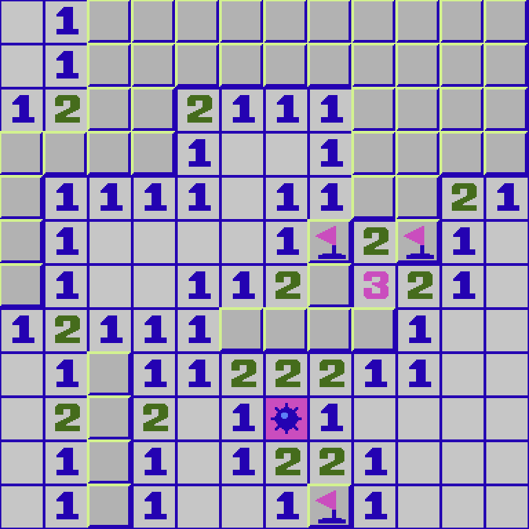

# RustySweeper

This is an implementation of the classic Minesweeper game, built using the Rust programming language and Bevy Framework.



## Running the app
Development:
```bash
cargo run --features debug
```

Lauch in browser:

```bash
cargo run --target wasm32-unknown-unknown
```
